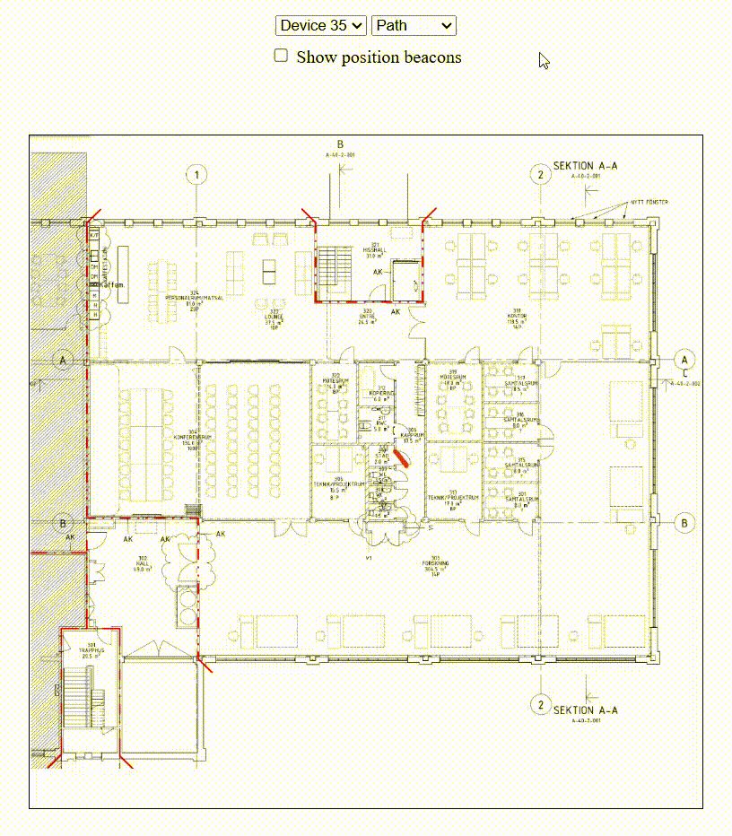

# Wittra_tracking
HackFactory 2025: Wittra tracking solution


### Project idea summary
This project explores the possibility of creating a system to track the positions of resources and carriers (e.g., forklifts). The system gathers real-time data using **Wittra IoT sensors** via the **Wittra API** and visualizes these positions through paths and heatmaps for analysis.



## Features
- Real-time tracking
- Position monitoring
- Data visualization (paths, heatmaps)
- Ability to show **positioning beacons**

## Limitations
- Uses latitude/longitude with limited precision (can be improved using RSSI)
- Floor level information is not visualized accurately (e.g., devices on the bottom floor appear on the top floor)
- Basic and minimal design meant to showcase the concept, not a production UI


## Getting Started

### Prerequisites
- [Node.js](https://nodejs.org/) installed

### Installation
1. Clone the repository
```bash
git clone https://github.com/EricJansson/Wittra_tracking.git
cd Wittra_tracking
```

2. Install dependencies
```bash
npm install
```

### Running the Project
```bash
npm start
```
